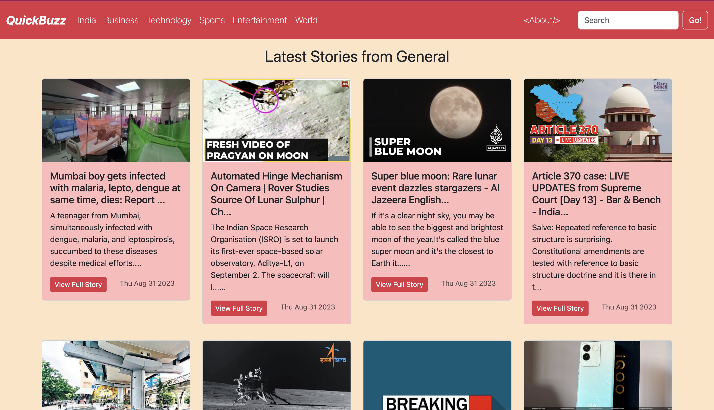

# QuickBuzz - A React news app.

QuickBuzz is a react app that utilises the NewsAPI to display the latest news. Readers can view the showcase or choose from different categories , business, technology, sports, etc.
A search bar is available to filter news by keywords.
Local weather and live stock information feature is to be added.

'infinite-scroll' and 'loading-bar' npm packages have been used to improve UX.

In the project directory, you can run:
### `npm start`

Runs the app in the development mode.\
Open [http://localhost:3000](http://localhost:3000) to view it in your browser.

The page will reload when you make changes.\
You may also see any lint errors in the console.

### Installation
git clone https://github.com/your-username/your-project.git
***
cd your-project
npm install
***
npm start

